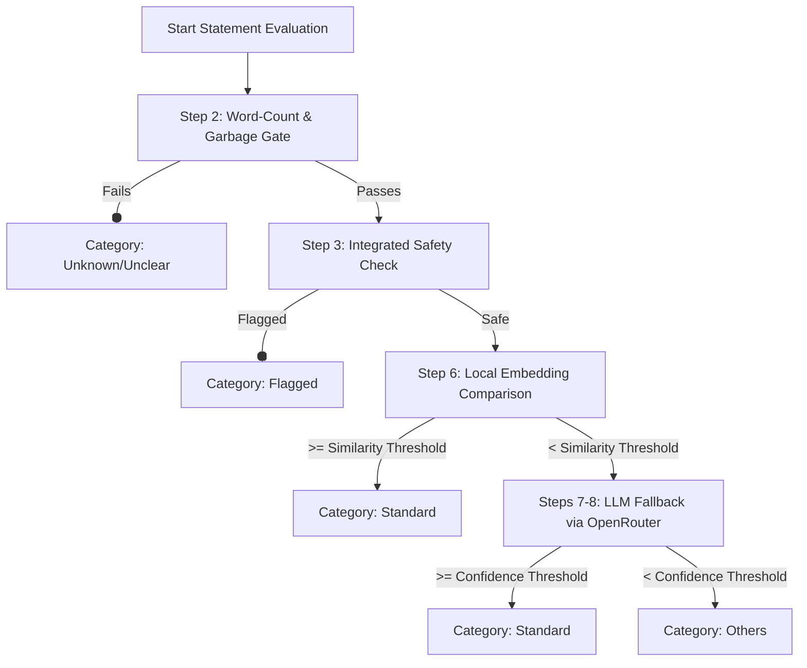

# Thematic Classification Activity (`thematic_activity.py`)

This README documents the design, workflow steps, configurations, and heuristics of the **Thematic Classification Activity** implemented inside the Temporal workflow.

---

## 1. Overview

The thematic classification activity (`thematic_classification_activity`) parses text values from submission columns (such as `objective` or `challenges`) and maps them to approved standardized themes.

It processes statements sequentially through a structured, multi-step validation and classification pipeline, assigning each statement one of the following four **Category Types**:
*   **`Standard`**: A valid statement mapped to an approved taxonomy theme.
*   **`Others`**: A valid statement that does not match any approved taxonomy theme or falls below the LLM confidence threshold.
*   **`Unknown/Unclear`**: Statements containing spam, garbled text, placeholders, or those that fail the minimum word count gate.
*   **`Flagged`**: Statements from columns that were flagged for containing sensitive PII or abusive language during the first pipeline step.

---

## 2. Integrated Safety & Ingestion Pipeline

---

## 3. Detailed Pipeline Steps

### Step 1: Extract Text & Read Config
Retrieves the submission text from target columns config (configured in `.env` under `PROCESS_CONFIG_STORY` and `PROCESS_CONFIG_DISCUSSION`).

### Step 1b: Discussion Statement Extraction
Discussion columns (`challenges`, `solutions`) are stored as `TEXT[]` — each array element is already a discrete statement and is analyzed independently, with no delimiter splitting or JSON parsing involved. This avoids the ambiguity of delimiter-splitting, since a statement could legitimately contain any given delimiter character itself.

### Step 2: Word-Count & Garbage Gate (`Unknown/Unclear`)
Before classifying, statements are evaluated using fast, local heuristics to skip non-meaningful content:
1.  **Word Count**: Statement must have >= `MINIMUM_THEME_WORD_COUNT` words.
2.  **Alphabet Presence**: Text must contain at least one alphabetic character (supporting both English and Devanagari/Indic script ranges).
3.  **Consecutive Repetition**: Checks if a single character is repeated 4+ times consecutively (e.g., `"aaaa"`, `"...."`).
4.  **Placeholder Words**: Matches (case-insensitively) common test values: `"test"`, `"testing"`, `"demo"`, `"dummy"`, `"asdf"`, `"qwerty"`, `"placeholder"`, `"abc"`, `"xyz"`, `"nothing"`, `"none"`, `"nil"`, `"n/a"`, `"na"`.
5.  **Keyboard Mashes**: Scans for English words of length >= 6 containing 0 vowels (e.g., `"qwrtsdfg"`).
6.  **Repetitive Token Spam**: If unique words make up less than 30% of the total words (applied for statements with 3+ words, e.g., `"hello hello hello"`).

If any of these heuristics trip, the statement is classified as **`Unknown/Unclear`** and saved immediately without making LLM calls.

### Step 3: Safety Check (`Flagged`)
Integrates directly with the outputs of the PII & Abusive Language detection step:
- Reads the `pii_masked_at` and `abusive_masked_at` columns populated by step 1 from the database.
- If the current column name (e.g. `'challenges'` or `'objective'`) is present in either array, the statement is tagged as **`Flagged`** and immediately saved.

### Step 4: STOP point for Unknown / Flagged
Short-circuits evaluation for invalid or unsafe statements, protecting LLM token limits and classification metrics.

### Step 5: Fetch Approved Themes
Loads all approved themes from the `themes` database table, including names, definitions, and keywords.

### Step 6: Local Embedding Comparison (`Standard`)
- Builds high-dimensional vector representations of approved themes once per run.
- Generates the statement's vector representation using the local Sentence-Transformers model (`EMBEDDING_MODEL_NAME`, default: `all-MiniLM-L6-v2`).
- Calculates cosine similarity against all approved theme vectors.
- If similarity >= `SIMILARITY_SCORE_THRESHOLD` (default: `0.65`), the statement is assigned the best-matching theme and marked as **`Standard`**, bypassing LLM fallback.

### Steps 7-8: LLM Fallback (OpenRouter)
- If the local similarity is low, the statement is sent to the LLM (configured under `OPENROUTER_MODEL`).
- The LLM receives the statement and the list of approved themes, and returns a JSON detailing:
  - `theme_id`: The ID of the matching theme, or `null`.
  - `confidence`: Confidence score (0.0 to 1.0).
  - `justification`: Concise explanation.

### Step 9: Finalize Category Type (`Standard` / `Others`)
- If LLM confidence >= `LLM_CONFIDENCE_SCORE_THRESHOLD` (default: `0.8` / 80%) and a matching theme is found: Classified as **`Standard`** with the selected theme.
- Else: Classified as **`Others`** (Misfit).

---

## 4. Configuration Settings

Key parameters loaded from environment variables (`.env`):

| Variable | Default | Purpose |
| :--- | :--- | :--- |
| `MINIMUM_THEME_WORD_COUNT` | `5` | Words threshold below which statements fail Step 2. |
| `EMBEDDING_MODEL_NAME` | `all-MiniLM-L6-v2` | Local model name for cosine similarity checks. |
| `SIMILARITY_SCORE_THRESHOLD` | `0.65` | Cosine similarity threshold for Step 6. |
| `LLM_CONFIDENCE_SCORE_THRESHOLD` | `0.8` | LLM confidence threshold for Step 8. |
