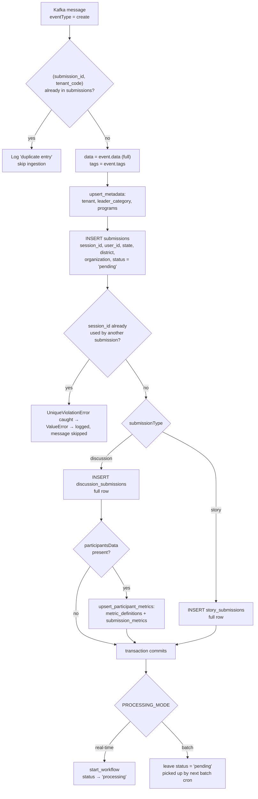
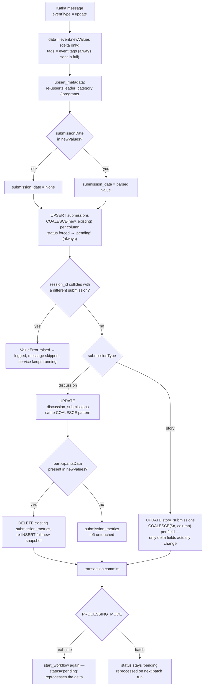
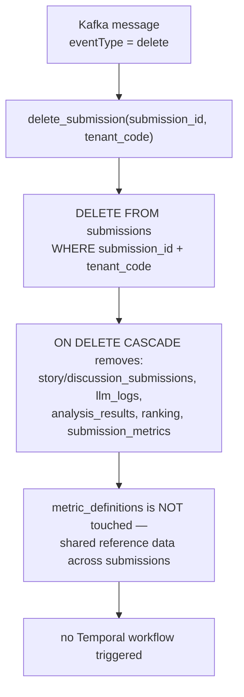
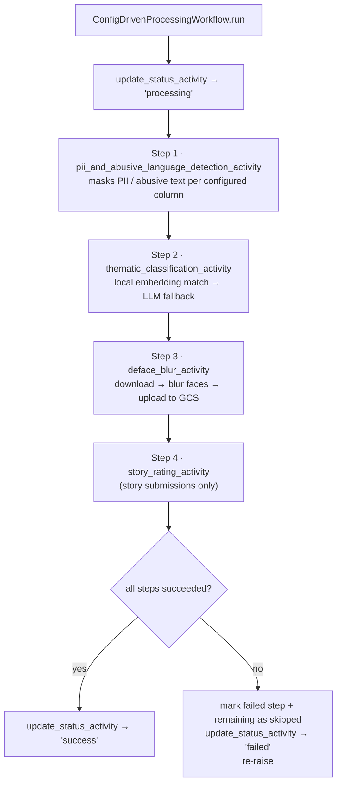

# Kafka Ingestion — Event Flows

Every message on `analytics.ingestion.raw` carries an `eventType` of `create`, `update`, or `delete`. Each takes a different path through `insert_or_update_submission` — this doc traces exactly what gets read, written, and triggered for each one.

## At a glance

| | create | update | delete |
|---|---|---|---|
| data source | `event.data` (full object) | `event.newValues` (delta only) | — |
| pre-check | rejected if `(submission_id, tenant_code)` already exists | rejected if `session_id` belongs to a *different* submission | none |
| column writes | every column set from `data` | `COALESCE(new, existing)` — only delta fields change | row + cascades removed |
| `participantsData` | written to `submission_metrics` | replaced in full if present, untouched if absent | cascade-deleted with the row |
| status after | `pending` | `pending` — forces full reprocessing | row gone |
| triggers workflow | yes, in real-time mode | yes, in real-time mode | no |

> **try/except**: every message is processed inside a guard in the consumer's poll loop — a bad payload, a `ValueError` from a rejected write, or any other exception is logged with the raw message and the loop moves on. One bad message never takes down the consumer or the Temporal worker.

---

## `create` — new submission

The full `data` object is written top to bottom. A `session_id` collision or a duplicate `(submission_id, tenant_code)` stops ingestion before anything is written.

`consumer.py` 116–134 &middot; `operations.py` 124–229, 349–366

---

## `update` — partial update

`newValues` is delta-only — a field missing from it means "unchanged," not "clear it." Every write uses `COALESCE(new, existing)` so fields outside the delta — including any already PII-masked text — are left exactly as they are.

`operations.py` 141–156, 175–229, 244–260, 363–393

---

## `delete` — remove submission

A single `DELETE` on `submissions` — everything else disappears via foreign-key cascade. No workflow runs.

`operations.py` 116–128 &middot; `schema.sql` ON DELETE CASCADE, 71–258

---

## Shared downstream Temporal workflow

Both `create` and `update` end the same way in real-time mode: a `ConfigDrivenProcessingWorkflow` run, driven by the tenant's `PROCESS_CONFIG_STORY` / `PROCESS_CONFIG_DISCUSSION` step list.

`workflows.py` 17–189 — each step's `llm_model` / `max_tokens` / `llm_timeout_seconds` can be overridden per step in the config JSON.

---

*analytics_service — traced from `app/kafka/consumer.py`, `app/database/operations.py`, `app/temporal/workflows.py`*
